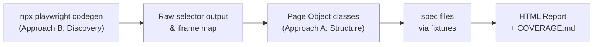

# Hybrid Playwright Automation Framework — Jira Portal

## What the Hybrid Approach Means

The strategy merges the best of both documented approaches:

- **Approach B element (Discovery):** Use `npx playwright codegen` and a `npm run discover:selectors` script to rapidly identify stable selectors, iframe structures, and page flows. All discovered output is persisted — never thrown away.
- **Approach A element (Structure):** Discovered selectors are immediately promoted into Page Object Model classes, shared utilities, and typed test data files. The full POM framework is the single source of truth for all test authoring.



---

## Hybrid Selector Lifecycle

1. Run `npx playwright codegen https://jira2-stage.eyepax.info/app_login/` for a new module
2. Copy the generated script into `utils/selector-discovery.ts` (dev-only, not run in CI)
3. Refine selectors following the priority order (see Test Guidelines doc)
4. Promote stable selectors into the appropriate `pages/<module>/` Page Object class
5. Store module URLs in `test-data/module-urls.ts` — never hardcode in specs

---

## Project Folder Structure

Extends the existing layout (preserving `recordings/`, `test cases/`, `docs/`):

```
c:\Eyepax\Projects\Jira Portal\
├── playwright.config.ts
├── tsconfig.json
├── .env.example                        # committed template
├── .env                                # real credentials (gitignored)
├── global-setup.ts                     # login once per role, save storageState
│
├── fixtures/
│   ├── base.fixture.ts                 # merges all custom fixtures
│   └── auth.fixture.ts                 # role-aware page factory
│
├── pages/                              # Page Object Model
│   ├── BasePage.ts                     # iframe resolver, nav helpers
│   ├── LoginPage.ts
│   └── dashboard/
│       ├── UserDashboardPage.ts
│       └── CulturalDashboardPage.ts
│
├── tests/
│   ├── auth/
│   │   ├── login.spec.ts
│   │   └── forgot-password.spec.ts
│   └── dashboard/
│       ├── user-dashboard.spec.ts
│       └── cultural-dashboard.spec.ts
│
├── utils/
│   ├── frame-helper.ts                 # iframe traversal (critical for Scriptcase)
│   ├── table-helper.ts                 # DataTable scraping
│   ├── date-helper.ts                  # year/month calculations
│   └── selector-discovery.ts          # dev-time codegen aid (excluded from CI)
│
├── test-data/
│   ├── users.ts                        # roles from env vars
│   ├── expected-values.ts              # static heading strings, year maps
│   └── module-urls.ts                  # /EYEPAX/?nmgp_opcao=... param map
│
├── auth/                               # saved storageState (gitignored)
│   ├── user.json
│   ├── supervisor.json
│   └── admin.json
│
├── test-results/                       # Playwright raw results (gitignored)
├── playwright-report/                  # HTML report output (gitignored)
├── coverage-reports/                   # dated report snapshots (gitignored)
│   └── YYYY-MM-DD/
│
├── .github/
│   └── workflows/
│       └── e2e.yml
│
├── recordings/                         # (existing — walkthrough videos)
├── test cases/                         # (existing — CSV/XLSX test cases)
└── docs/
    ├── ui automation strategy.md       # (existing)
    ├── AUTOMATION_STRATEGY.md          # (new — finalized hybrid strategy)
    ├── ARCHITECTURE.md                 # (new — architecture & folder guide)
    ├── TEST_GUIDELINES.md              # (new — writing standards & selector rules)
    ├── COVERAGE.md                     # (new — live coverage history log)
    └── video-analysis/                 # (new — timestamped flow sheets)
        ├── login-forgot-password.md
        ├── login-mode-update.md
        └── user-dashboard-year-dropdown.md
```

---

## Key Framework Components

### `playwright.config.ts`
- `testDir: './tests'`, `globalSetup: './global-setup.ts'`
- `timeout: 60_000`, `actionTimeout: 15_000`, `navigationTimeout: 30_000`
- `retries: CI ? 2 : 1`
- `trace: 'on-first-retry'`, `screenshot: 'only-on-failure'`, `video: 'on-first-retry'`
- Reporters: `['html']`, `['junit', { outputFile: 'test-results/junit.xml' }]`
- Primary project: `chromium`; Firefox/WebKit on scheduled CI only

### `global-setup.ts` + `fixtures/auth.fixture.ts`
- Login once per role (User, Supervisor, Admin), persist via `context.storageState()`
- Spec files declare role with `test.use({ storageState: 'auth/user.json' })`
- Fixture re-authenticates if a 401/redirect is detected mid-run

### `utils/frame-helper.ts`
Critical for Scriptcase's nested iframe architecture:
- `resolveContentFrame(page)` — resolves `#ifrApp > #ifrContent`
- `resolveGridFrame(page)` — resolves `#ifrApp > #ifrContent > #ifrGrid`
- `waitForFrameLoad(frame)` — waits for `body` visible inside frame

### `pages/BasePage.ts`
All Page Objects extend `BasePage` which exposes `contentFrame()`, `gridFrame()`, and `navigateTo(moduleParam)`.

---

## Selector Priority Rules (Scriptcase-specific)

1. `getByRole` + accessible name
2. `getByLabel` (Scriptcase form fields)
3. `name` attribute: `locator('[name="year_filter"]')`
4. `getByText` / `filter({ hasText: ... })` for static headings
5. Scoped CSS: panel container + child element
6. **Never use:** hash-suffixed `id` values, absolute XPath

---

## `package.json` Scripts

```json
{
  "test": "playwright test",
  "test:ui": "playwright test --ui",
  "test:headed": "playwright test --headed",
  "test:auth": "playwright test tests/auth/",
  "test:dashboard": "playwright test tests/dashboard/",
  "test:grep": "playwright test --grep",
  "test:ci": "playwright test --reporter=junit,html",
  "codegen": "playwright codegen https://jira2-stage.eyepax.info/app_login/",
  "discover:selectors": "npx ts-node utils/selector-discovery.ts",
  "report": "playwright show-report",
  "coverage:update": "node scripts/update-coverage.js"
}
```

---

## Coverage Reporting Strategy

- Every test run generates an HTML report saved to `playwright-report/`
- A `scripts/update-coverage.js` script appends a dated summary row to `docs/COVERAGE.md` automatically
- `COVERAGE.md` format: date | total tests | passed | failed | skipped | new failures | notes
- `coverage-reports/YYYY-MM-DD/` preserves a snapshot of the HTML report for that run
- CI uploads `playwright-report/` as a GitHub Actions artifact on every run

---

## `docs/COVERAGE.md` Structure

```markdown
# Coverage History

| Date       | Total | Passed | Failed | Skipped | Notes |
|------------|-------|--------|--------|---------|-------|
| 2026-05-07 | 0     | 0      | 0      | 0       | Initial scaffold |
```

---

## Test Naming Convention

```
<TestCaseId> | <ModuleName> - <Scenario>
// e.g. "UDY-003 | Dashboard - Select year 2026 updates leave summary heading"
```

---

## Documentation Files to Create

- [`docs/AUTOMATION_STRATEGY.md`](docs/AUTOMATION_STRATEGY.md) — finalized hybrid approach, phase plan, risk register
- [`docs/ARCHITECTURE.md`](docs/ARCHITECTURE.md) — folder structure guide, component roles, data flow diagrams
- [`docs/TEST_GUIDELINES.md`](docs/TEST_GUIDELINES.md) — test writing standards, selector rules, naming conventions, assertion patterns, known-failure tagging
- [`docs/COVERAGE.md`](docs/COVERAGE.md) — live coverage history log, updated after every run

---

## Implementation Phases

- **Phase 1 (Days 1–3) — Scaffold:** `playwright.config.ts`, `tsconfig.json`, `.env.example`, `global-setup.ts`, `utils/frame-helper.ts`, `pages/BasePage.ts`, `pages/LoginPage.ts`, `fixtures/`, `test-data/`, all four `docs/` files, `scripts/update-coverage.js`
- **Phase 2 (Days 4–7) — Tier 1 Tests:** `login.spec.ts`, `forgot-password.spec.ts`, `user-dashboard.spec.ts`; confirm green locally; first `COVERAGE.md` entry
- **Phase 3 (Days 8–12) — Tier 2 + CI:** `cultural-dashboard.spec.ts`, CDV data-integrity cases; GitHub Actions `e2e.yml`; Allure reporter integration
- **Phase 4 (Ongoing) — Expansion:** Remaining modules (Teams, Clockwise, Leave History); tag `test.fail()` for IEJP-9366/9367; visual regression snapshots
