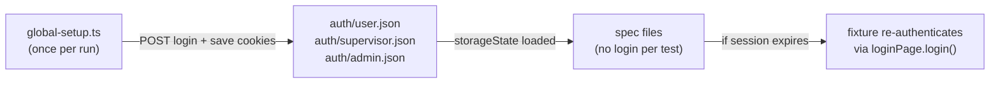
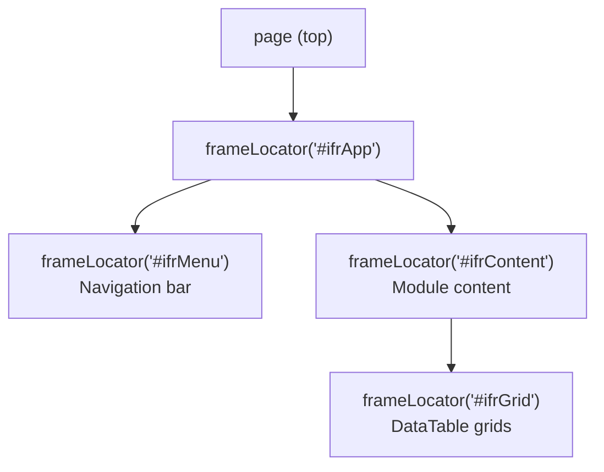

# Playwright Scale-Up Framework — Jira Portal

## Current Baseline

- `@playwright/test` v1.59.1 installed, npm scripts present in `[package.json](c:\Eyepax\Projects\Jira Portal\package.json)`
- No automation code committed yet — knowledge gained from codegen/inspection (login selectors, iframe structure, year dropdown, module routes) needs to be formalized
- Known selectors: `#inputEmail`, `#inputPassword`, "Sign in" button; `#year-select`; `/EYEPAX/?...` URL params for module navigation
- Existing manual test cases in `Test cases - (UserDashboard).csv` and `Jira Portal Test Cases.xlsx`

---

## 1. Target Project Structure

```
c:\Eyepax\Projects\Jira Portal\
├── playwright.config.ts
├── .env.example                         # template (committed)
├── .env                                 # real secrets (gitignored)
├── global-setup.ts                      # login once per role, save storageState
├── fixtures/
│   ├── base.fixture.ts                  # extends test with all custom fixtures
│   └── auth.fixture.ts                  # role-aware page/context factory
├── pages/                               # Page Object Model
│   ├── LoginPage.ts
│   ├── BasePage.ts                      # shared iframe resolver, nav helpers
│   ├── dashboard/
│   │   ├── UserDashboardPage.ts
│   │   └── CulturalDashboardPage.ts
│   ├── clockwise/
│   │   ├── ProcedureMissesPage.ts
│   │   └── ClockwiseDataPage.ts
│   ├── teams/
│   │   └── ProductionTeamsPage.ts
│   ├── leave/
│   │   └── LeaveModulePage.ts
│   └── settings/
│       └── SettingsPage.ts
├── tests/
│   ├── auth/
│   │   ├── login.spec.ts
│   │   └── forgot-password.spec.ts
│   ├── dashboard/
│   │   ├── user-dashboard-year-dropdown.spec.ts
│   │   ├── leave-summary.spec.ts
│   │   ├── cultural-dashboard.spec.ts
│   │   └── procedure-misses.spec.ts
│   ├── teams/
│   │   └── production-teams.spec.ts
│   ├── clockwise/
│   │   └── procedure-misses-report.spec.ts
│   ├── leave/
│   │   └── leave-history.spec.ts
│   └── rbac/
│       └── unauthorized-access.spec.ts
├── utils/
│   ├── frame-helper.ts                  # iframe traversal & wait helpers
│   ├── table-helper.ts                  # DataTable scraping helpers
│   ├── date-helper.ts                   # year/month string calculations
│   └── selector-discovery.ts           # dev-time helper (not run in CI)
├── test-data/
│   ├── users.ts                         # roles mapped from env vars
│   ├── expected-values.ts               # static strings, year heading maps
│   └── module-urls.ts                   # /EYEPAX/?... param map per module
├── auth/                                # saved storageState (gitignored)
│   ├── user.json
│   ├── supervisor.json
│   └── admin.json
└── docs/
    └── video-analysis/                  # timestamped flow notes per video
```

---

## 2. Configuration Layer

### `playwright.config.ts` key settings

```typescript
export default defineConfig({
  globalSetup: './global-setup.ts',
  testDir: './tests',
  timeout: 60_000,
  use: {
    baseURL: process.env.BASE_URL,
    actionTimeout: 15_000,
    navigationTimeout: 30_000,
    trace: 'on-first-retry',
    screenshot: 'only-on-failure',
    video: 'on-first-retry',
  },
  retries: process.env.CI ? 2 : 1,
  reporter: [['html'], ['junit', { outputFile: 'test-results/junit.xml' }]],
  projects: [
    { name: 'chromium', use: { ...devices['Desktop Chrome'] } },
    // firefox/webkit only run on scheduled CI, not per-commit
  ],
});
```

### `.env.example` (committed template)

```
BASE_URL=https://jira2-stage.eyepax.info
E2E_USER_ID=
E2E_PASSWORD=
E2E_SUPERVISOR_ID=
E2E_SUPERVISOR_PASSWORD=
E2E_ADMIN_ID=
E2E_ADMIN_PASSWORD=
```

### `test-data/users.ts`

```typescript
export const Users = {
  user:       { id: process.env.E2E_USER_ID!,       pass: process.env.E2E_PASSWORD! },
  supervisor: { id: process.env.E2E_SUPERVISOR_ID!, pass: process.env.E2E_SUPERVISOR_PASSWORD! },
  admin:      { id: process.env.E2E_ADMIN_ID!,      pass: process.env.E2E_ADMIN_PASSWORD! },
} as const;
export type Role = keyof typeof Users;
```

---

## 3. Authentication & Session Management

### `global-setup.ts` — runs once before the entire suite

```typescript
// For each role: login via UI, save storageState to auth/<role>.json
// Tests then load the pre-authenticated state — no per-test login
```

### `fixtures/auth.fixture.ts`

```typescript
// Provides: test.use({ storageState: 'auth/user.json' })
// Provides a custom `rolePage` fixture that accepts a Role and
// returns an authenticated page with correct storageState loaded
```

### Session reuse flow




---

## 4. Iframe Handling Strategy

Scriptcase nests content across 2–3 iframe levels. All module interactions must go through `frame-helper.ts`.

### `utils/frame-helper.ts` — canonical iframe resolution

```typescript
// resolveContentFrame(page): resolves #ifrApp > #ifrContent
// resolveGridFrame(page):    resolves #ifrApp > #ifrContent > #ifrGrid
// waitForFrameLoad(frame):   waits for body to be visible inside frame
```

### `pages/BasePage.ts` — all Page Objects extend this

```typescript
class BasePage {
  async contentFrame() { return resolveContentFrame(this.page); }
  async gridFrame()    { return resolveGridFrame(this.page); }
  async navigateTo(moduleParam: string) {
    // preserves /EYEPAX/?... param structure
  }
}
```

### iframe depth map (Scriptcase)




---

## 5. Page Object Model Design

### `pages/LoginPage.ts`

```typescript
class LoginPage {
  // selectors already identified:
  // #inputEmail, #inputPassword, getByRole('button', { name: 'Sign in' })
  async login(id: string, password: string): Promise<void>
  async forgotPassword(email: string): Promise<void>
}
```

### `pages/dashboard/UserDashboardPage.ts`

```typescript
class UserDashboardPage extends BasePage {
  // #year-select (already identified)
  async selectYear(year: number): Promise<void>
  async getLeaveSummaryHeading(): Promise<string>
  async getCulturalActivitiesHeading(): Promise<string>
  async getProcedureMissesMonthCount(month: string): Promise<number>
  async getNoticeSummaryRows(): Promise<string[]>
}
```

### `pages/dashboard/CulturalDashboardPage.ts`

```typescript
class CulturalDashboardPage extends BasePage {
  async getConductedCount(activity: 'Coaching' | 'Sit-with' | '1on1'): Promise<number>
  async getParticipatedCount(activity: string): Promise<number>
  async getMostRecentEvents(): Promise<string[]>
}
```

---

## 6. Test Design Strategy

### Test tier priority (from existing CSV feasibility column)


| Tier | Feasibility | Priority | Action                                                     |
| ---- | ----------- | -------- | ---------------------------------------------------------- |
| 1    | Yes         | High     | Automate now — UDL-001/002/013, UDY-001–009, CD-001, Login |
| 2    | Partial     | High     | Automate with data guards — CDV-001–009, PMD series        |
| 3    | Partial     | Medium   | Automate with soft assertions                              |
| 4    | No          | Any      | K eep manual — cross-browser, accessibility                |


### Known-failing tests — tag explicitly

```typescript
// CDV-003 (IEJP-9366), TC-LEAVE-020 (IEJP-9367)
test.fail(true, 'Bug IEJP-9366 — Sit-with count mismatch');
test('CDV-003 | ...', async ({ page }) => { ... });
```

### Assertion strategy

- Use `expect.soft()` for multi-assertion tests (all assertions run even if one fails)
- Use `toHaveText()` / `toContainText()` for heading strings (most stable in Scriptcase)
- Avoid strict numeric equality for data-integrity tests unless test user data is fixed

### Test naming convention

```
<TestCaseId> | <ModuleName> - <Scenario>
// e.g. "UDY-003 | Dashboard - Select year 2026 updates headings"
```

---

## 7. Selector Standardization

Priority order (most to least stable for Scriptcase):

1. `getByRole` + accessible name
2. `getByLabel` (Scriptcase form fields)
3. `name` attribute: `locator('[name="year_filter"]')`
4. `getByText` / `filter({ hasText: ... })` for headings
5. Scoped CSS: panel container + child element
6. Never: hash-suffixed `id`, absolute XPath

### `test-data/module-urls.ts`

```typescript
// Centralizes known /EYEPAX/?... params so tests never hardcode URLs
export const ModuleURLs = {
  dashboard:        '/EYEPAX/?nmgp_opcao=dashboard',
  culturalDashboard:'/EYEPAX/?nmgp_opcao=cultural_dashboard',
  productionTeams:  '/EYEPAX/?nmgp_opcao=production_teams',
  procedureMisses:  '/EYEPAX/?nmgp_opcao=procedure_misses',
  // ...
};
```

---

## 8. CI/CD Execution Plan

### Local

```bash
npx playwright test                        # full suite
npx playwright test tests/dashboard/       # single module
npx playwright test --grep "UDY"           # by test ID prefix
npx playwright test --ui                   # interactive UI mode
```

### GitHub Actions workflow

```yaml
name: E2E Tests
on:
  push:    { branches: [main] }
  schedule: [{ cron: '0 22 * * *' }]   # nightly at 22:00 UTC (03:30 IST)
jobs:
  test:
    runs-on: ubuntu-latest
    steps:
      - uses: actions/checkout@v4
      - uses: actions/setup-node@v4
        with: { node-version: '20' }
      - run: npm ci
      - run: npx playwright install --with-deps chromium
      - run: npx playwright test
        env:
          BASE_URL: ${{ secrets.BASE_URL }}
          E2E_USER_ID: ${{ secrets.E2E_USER_ID }}
          E2E_PASSWORD: ${{ secrets.E2E_PASSWORD }}
      - uses: actions/upload-artifact@v4
        if: always()
        with:
          name: playwright-report
          path: playwright-report/
```

---

## 9. Scalability & Maintenance Strategy

- Add a new module: create `pages/<module>/`, one `tests/<module>/*.spec.ts`, register URL in `module-urls.ts` — nothing else changes
- After a Scriptcase re-publish: run `npm run codegen` on affected module, audit only selectors in that module's Page Object file
- Test data changes: update `test-data/expected-values.ts` — spec files stay untouched
- Bug resolution: find tests tagged `test.fail()` with Jira ID, promote to `test()` once ticket closes
- Add `eslint-plugin-playwright` to enforce: no `waitForTimeout`, no absolute XPath, no hardcoded credentials

---

## 10. Risk Areas & Mitigations


| Risk                                           | Mitigation                                                                  |
| ---------------------------------------------- | --------------------------------------------------------------------------- |
| Scriptcase iframe nesting breaks on re-publish | `frame-helper.ts` centralizes iframe resolution — fix in one place          |
| Dynamic session-based `id` attributes          | `name` / `role` / `getByText` selectors are unaffected                      |
| Slow PHP/XHR responses                         | `actionTimeout: 15_000`, `waitForLoadState('networkidle')` after navigation |
| Test data changes break CDV assertions         | Dedicate a fixed test user account with locked historical records           |
| Stage environment downtime in CI               | Add `--retries=2` and a health-check step before test run                   |
| Scriptcase session timeout in long runs        | `global-setup` refreshes tokens; fixture re-authenticates if 401 detected   |


---

## 11. Implementation Phases

- **Phase 1 (Days 1–3):** Scaffold `playwright.config.ts`, `.env.example`, `global-setup.ts`, `utils/frame-helper.ts`, `pages/BasePage.ts`, `pages/LoginPage.ts`, `fixtures/`, `test-data/`
- **Phase 2 (Days 4–7):** Implement Tier 1 specs — `login.spec.ts`, `user-dashboard-year-dropdown.spec.ts`, `leave-summary.spec.ts`; confirm green in local run
- **Phase 3 (Days 8–12):** Add `CulturalDashboardPage`, `cultural-dashboard.spec.ts`, CDV data-integrity cases (Tier 2); add GitHub Actions workflow
- **Phase 4 (Days 13–18):** Remaining modules — Teams, Clockwise, Leave History; add Allure reporter; tag known-failing tests
- **Phase 5 (Ongoing):** Add visual regression snapshots for key panels; migrate remaining rows from `Jira Portal Test Cases.xlsx`

