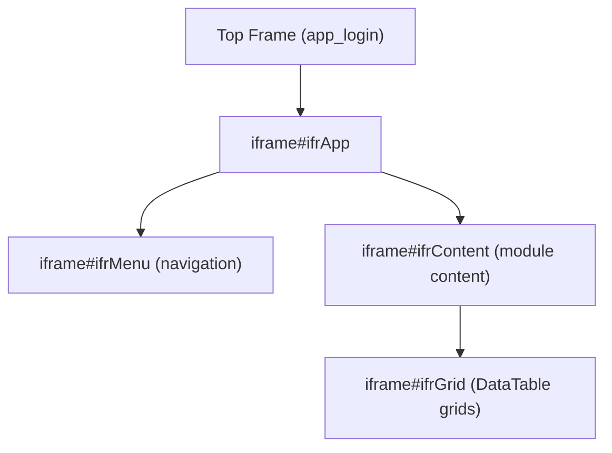
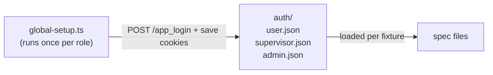

# Scriptcase Jira Portal — Playwright Automation Strategy

## Context & Assets Inventory

- **Live app:** https://jira2-stage.eyepax.info/app_login/
- **Existing test cases:** `Test cases - (UserDashboard).csv` (also a full `Jira Portal Test Cases.xlsx`)
- **Walkthrough videos:**
  - `Recordings/Login/Login_Forgot_password.mp4`
  - `Recordings/Login/Login_Mode_update.mp4`
  - `Recordings/User's Dashboard/Login_Cultural_Dashboard.mp4`
  - `Recordings/User's Dashboard/Login_User_Dashboard.mp4`
  - `Recordings/User's Dashboard/UserDashboard_ChangeYearDropDownShortCultural.mp4`
  - `Recordings/User's Dashboard/UserDashboard_ChangeYearDropDownShortUser.mp4`

---

## 1. Discovery & Analysis of Scriptcase-Generated UI

Scriptcase generates PHP applications with heavily auto-generated HTML. Key characteristics to understand before writing a single selector:

**Scriptcase HTML fingerprints:**
- Most interactive widgets live inside **nested iframes** (`<iframe id="ifrApp">` wrapping sub-frames per module)
- Grid components use jQuery DataTables; form fields follow naming like `id_<field_name>`, `nm_<field_name>`
- Dropdown/select boxes for year pickers are rendered as `<select>` or jQuery-UI widgets
- Buttons use classes like `.btn-sc`, `.sc_bt`, or image-based `<input type="image">`
- Dynamic session-based IDs are common (e.g., `id="sc_field_1a3f_year"`) — **never rely on these**

**Discovery workflow (do this before any coding):**
1. Open Chrome DevTools → record a Playwright codegen session: `npx playwright codegen https://jira2-stage.eyepax.info/app_login/`
2. For each module (Dashboard, Tasks, Reports, Settings), manually perform every key action while codegen records selectors
3. In DevTools → Elements panel, inspect every interactive element and note:
   - Stable attributes: `name`, `data-*`, `aria-label`, `aria-labelledby`, `role`, `placeholder`
   - Iframe hierarchy depth (Scriptcase often nests 2–3 iframes)
   - Table/grid structure (column headers, row patterns)
4. Export the codegen output as a reference map — do not use these selectors directly; refine them per Section 4

**Iframe handling pattern (critical for Scriptcase):**

Every Playwright interaction inside a module must traverse this frame chain using `page.frameLocator()`.

---

## 2. Video Utilization Workflow

**Step-by-step extraction process:**
1. Watch each video at 0.5× speed; timestamp every distinct user action (click, fill, assert)
2. Build a **Flow Sheet** (one row per action) with columns: `Timestamp | Action | Element Description | Value | Expected Outcome`
3. Cross-reference against the CSV test cases (many already reference "as in video")
4. Identify **edge cases** visible in video that are NOT yet in the CSV (e.g., loading spinners, empty state messages, error toasts)
5. For the Year Dropdown videos specifically, document the exact heading text changes per year selection (already partially done in UDY-003 to UDY-005)

**Video → automation mapping table (example already derivable):**

- `UserDashboard_ChangeYearDropDownShortCultural.mp4` → maps to test IDs: CDV-001 through CDV-009
- `Login_Forgot_password.mp4` → maps to a new `auth/forgot-password.spec.ts`
- `Login_Mode_update.mp4` → maps to login mode toggle scenarios

**Tool:** Use VLC or browser-based video player; annotate with a timestamped note tool (e.g., Notion table or plain Markdown file stored in `/docs/video-analysis/`)

---

## 3. Test Case Migration Strategy

**Priority tiers (from the CSV's Automation Feasibility column):**
- **Tier 1 — Automate first:** Feasibility = "Yes" + Priority = High (UDL-001, UDL-002, UDL-013, CD-001, UDY-001 through UDY-009)
- **Tier 2 — Automate with guards:** Feasibility = "Partial" + Priority = High (CDV-001 to CDV-009, PMD series)
- **Tier 3 — Manual or semi-automated:** Feasibility = "No" or Accessibility/Cross-browser cases (UDY-013, UDY-014)

**Migration rules:**
- One CSV "section" (e.g., "Cultural Dashboard") → one `spec` file
- One CSV row → one `test()` block; keep the Test Case ID as the test title prefix: `test('CDV-001 | Cultural Dashboard - Coaching Conducted matches profile', ...)`
- Preconditions → `beforeEach` fixture
- Multi-step assertions → use `expect.soft()` so all assertions run even if one fails

**Known failures to flag:** CDV-003 (IEJP-9366) and TC-LEAVE-020 (IEJP-9367) should be tagged `test.fail()` or `test.skip()` with the Jira link in a comment until the bug is resolved.

---

## 4. Selector Strategy for Scriptcase

**Priority order for selectors (most stable → least stable):**
1. `aria-label`, `role` + accessible name (best for forms)
2. `name` attribute (Scriptcase form fields always have `name`)
3. `data-*` custom attributes if present
4. Stable CSS class combinations (e.g., `.sc_year_dropdown`, `.sc_btn_save`)
5. `:text()` or `:has-text()` pseudo-selectors for buttons/labels with static text
6. XPath with `normalize-space()` for heading text assertions
7. **Never use:** auto-generated `id` values with hash-like suffixes, absolute XPath `/html/body/...`

**Scriptcase-specific patterns:**
```typescript
// Year dropdown (Scriptcase select widget)
page.frameLocator('#ifrContent').locator('select[name="year_filter"]')

// DataTable row assertion
page.frameLocator('#ifrContent').frameLocator('#ifrGrid')
    .locator('table.dataTable tbody tr').filter({ hasText: 'Coaching' })

// Heading text assertion (stable)
page.frameLocator('#ifrContent').locator('h2, .sc_panel_title').filter({ hasText: 'LEAVE SUMMARY' })
```

**Flakiness mitigation:**
- Always `await page.waitForLoadState('networkidle')` after navigation in Scriptcase (it fires multiple XHR calls)
- Add `await frameLocator.locator('body').waitFor()` after switching into a new iframe
- Use `page.waitForSelector()` with a timeout of 15s for data-heavy grids
- Avoid `page.waitForTimeout()` — replace with element-state waits

---

## 5. Multi-Role Testing (RBAC)

**Roles identified from test cases:** Standard User (e.g., Neranjan Bandara, Udara Akmeemana), Supervisor, Admin (implied by Security module)

**Session storage strategy:**


**Implementation:**
- `global-setup.ts`: programmatically logs in each role, calls `context.storageState({ path })` to persist cookies/localStorage
- Define a `roleFixture` in `fixtures/auth.ts` that accepts a role parameter and restores the matching storage state
- Individual spec files declare their required role via fixture: `test.use({ storageState: 'auth/user.json' })`
- For tests that verify unauthorized access (UDL-013), use a fixture with no storage state (anonymous context)

**Session reuse:** Playwright's `storageState` means login happens **once per role per test run**, not per test — this is the key performance gain.

---

## 6. Framework Architecture

```
jira-portal-tests/
├── playwright.config.ts          # base URL, retries, reporters, projects per browser
├── package.json
├── auth/
│   ├── user.json                 # saved auth state (gitignored)
│   ├── supervisor.json
│   └── admin.json
├── global-setup.ts               # login all roles, save storageState
├── fixtures/
│   ├── auth.fixture.ts           # role-based context fixture
│   └── base.fixture.ts           # extend test with all fixtures
├── pages/                        # Page Object Model
│   ├── LoginPage.ts
│   ├── DashboardPage.ts
│   ├── CulturalDashboardPage.ts
│   ├── LeaveModule.ts
│   ├── ClockwisePage.ts
│   └── ...
├── tests/
│   ├── auth/
│   │   ├── login.spec.ts
│   │   └── forgot-password.spec.ts
│   ├── dashboard/
│   │   ├── user-dashboard-year-dropdown.spec.ts   # UDY-* cases
│   │   ├── leave-summary.spec.ts                  # UDL-* cases
│   │   ├── cultural-dashboard.spec.ts             # CD-* + CDV-* cases
│   │   └── procedure-misses.spec.ts               # PMD-* cases
│   └── rbac/
│       └── unauthorized-access.spec.ts
├── test-data/
│   ├── users.ts                  # credentials per role (loaded from env)
│   └── expected-values.ts        # static expected strings, year mappings
├── utils/
│   ├── frame-helper.ts           # iframe traversal helpers
│   ├── date-utils.ts             # year/month calculation helpers
│   └── table-utils.ts            # DataTable scraping helpers
└── docs/
    └── video-analysis/           # timestamped flow sheets from video review
```

**POM design principle:** Page classes expose **business-language methods**, not raw selectors:
```typescript
// DashboardPage.ts
class DashboardPage {
  async selectYear(year: number) { ... }
  async getCulturalActivitiesHeading(): Promise<string> { ... }
  async getProcedureMissesMonthCount(month: string): Promise<number> { ... }
}
```

**`playwright.config.ts` key settings:**
- `globalSetup: './global-setup.ts'`
- `retries: 1` (one retry for Scriptcase's network flakiness)
- `use.actionTimeout: 15000` (Scriptcase is slower than typical SPAs)
- Projects: `chromium` (primary), `firefox`, `webkit` (per-release only)
- Reporter: `html` + `junit` (for CI artifact uploads)

**Test data:** Never hardcode credentials. Load from `.env` file via `dotenv`:
```
JIRA_USER_EMAIL=user@eyepax.com
JIRA_USER_PASS=...
JIRA_SUPERVISOR_EMAIL=...
```

**CI/CD (GitHub Actions example):**
```yaml
- name: Run Playwright Tests
  run: npx playwright test --project=chromium
  env:
    JIRA_USER_EMAIL: ${{ secrets.JIRA_USER_EMAIL }}
    JIRA_USER_PASS: ${{ secrets.JIRA_USER_PASS }}
- name: Upload Report
  uses: actions/upload-artifact@v4
  with:
    name: playwright-report
    path: playwright-report/
```
Schedule nightly runs + trigger on manual dispatch for regression.

---

## 7. Key Risk Areas & Mitigations

| Risk | Impact | Mitigation |
|------|--------|------------|
| Scriptcase iframe nesting (2–3 levels deep) | High — selectors fail silently | Build `frame-helper.ts` utility that resolves the correct frame before every interaction |
| Dynamic session-based IDs on elements | High — selectors break on re-login | Selector strategy in Section 4 — `name`/`aria-label`/text-based only |
| Slow XHR/PHP response times | Medium — timeouts | Increase `actionTimeout` to 15s, use `networkidle` waits |
| Test data dependency (CDV-* data integrity tests) | High — flaky if DB changes | Use a dedicated test user with fixed historical data; document known counts in `expected-values.ts` |
| Known bugs (IEJP-9366, IEJP-9367) | Medium — tests fail for wrong reasons | Tag with `test.fail()` and Jira link; auto-promote to `test()` when Jira tickets close |
| Scriptcase session timeout during long test runs | Medium — mid-run logout | Configure Playwright `timeoout` per test; re-authenticate via fixture if session expires |
| Low-code UI updates (auto-regenerated HTML on Scriptcase re-publish) | High — mass selector breakage | Audit selectors after every Scriptcase app re-publish; `name` attributes tend to be most stable |

---

## 8. Toolchain Recommendations

**Core:** Playwright (TypeScript) — best choice for this scenario because:
- Native iframe support via `frameLocator()` (Cypress struggles with cross-origin iframes)
- Built-in network interception for XHR monitoring
- Multi-browser parallelism out of the box
- Storage state for session reuse (key for RBAC)

**Complementary tools:**

- **Reporting:** `@playwright/test` HTML reporter + **Allure Playwright** for richer test history and trend charts
- **Visual regression:** `@playwright/experimental-ct-react` or **Percy** / **Argos** — screenshot-diff specific panels (Cultural Activities, Leave Summary table) to catch layout regressions after Scriptcase re-publishes
- **API layer:** Playwright `request` fixture — use for test data setup/teardown if REST APIs are available (bypass UI for pre-conditions)
- **Test management sync:** Export Playwright JUnit XML → import into your existing Jira (IEJP project) test cycle via **Xray for Jira** plugin
- **Linting:** `eslint-plugin-playwright` to enforce no hard-coded waits, no absolute XPaths
- **Video analysis:** VLC (free) + a timestamped note table in `docs/video-analysis/` per video file

---

## 9. Implementation Phases

- **Phase 1 (Week 1–2) — Discovery & Setup**
  - Run `playwright codegen` against all major modules while logged in as each role
  - Build `frame-helper.ts` and validate iframe traversal for every module
  - Set up project scaffold, `.env`, `global-setup.ts`, auth fixtures
  - Analyze all 6 videos and complete `docs/video-analysis/` flow sheets

- **Phase 2 (Week 3–4) — Tier 1 Automation**
  - Automate all "Yes" feasibility + High priority cases: UDL-001, UDL-002, UDL-013, UDY-001–009, CD-001, CD-004, Login
  - Establish CI pipeline with nightly scheduled run

- **Phase 3 (Week 5–6) — Tier 2 Automation**
  - Automate "Partial" feasibility cases: CDV-001–009 (data integrity), PMD series
  - Add visual regression snapshots for key panels
  - Integrate Allure reporting

- **Phase 4 (Ongoing) — Maintenance & Expansion**
  - Migrate remaining modules from `Jira Portal Test Cases.xlsx`
  - Tag CDV-003 / TC-LEAVE-020 tests as `test.fail()` until Jira bugs are closed
  - Run cross-browser sweep (Firefox, WebKit) per release
