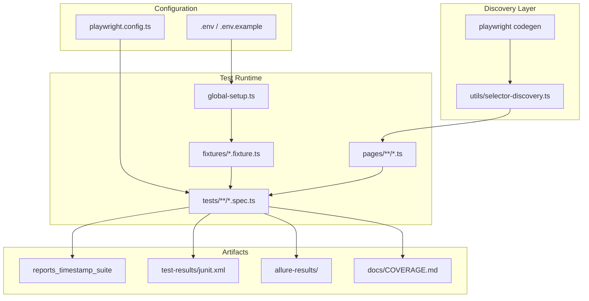
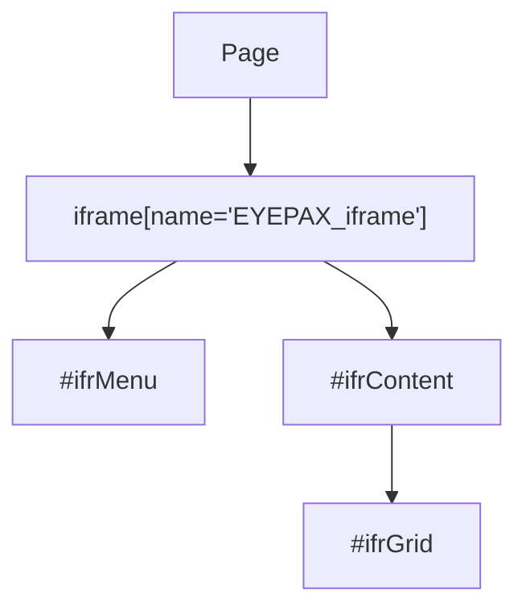
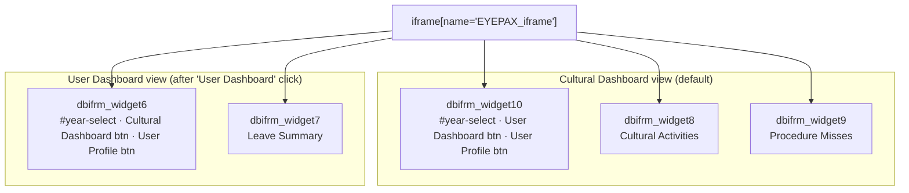
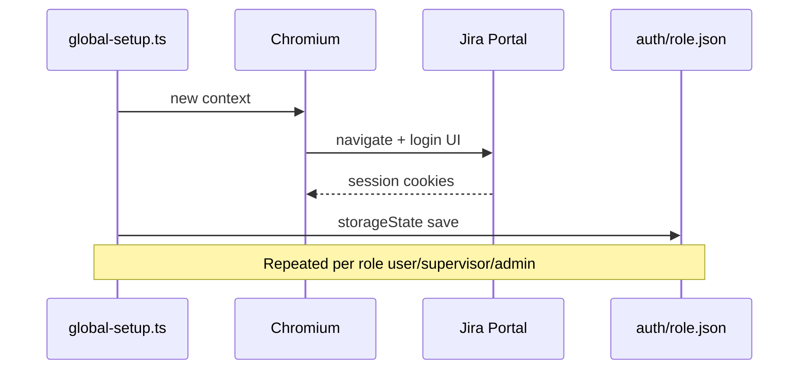

# Project Architecture & Folder Structure

## High-Level Architecture

---

## Directory Layout

| Path | Purpose |
| ---- | ------- |
| `playwright.config.ts` | Reporters (list, HTML, JUnit, Allure), env-driven headed/headless/slowMo/workers, sequential execution (`fullyParallel: false`), retries, projects |
| `global-setup.ts` | Per-role login → `auth/*.json` storage states |
| `scripts/` | Runner wrapper (`run-tests.js`) and coverage updater (`update-coverage.js`) |
| `fixtures/` | Extended `test` with auth-aware fixtures |
| `pages/` | Page Object Model; iframe-aware via `BasePage` |
| `tests/` | Specs grouped by feature (`auth/`, `dashboard/`, …) |
| `utils/` | Frame/table/date helpers; dev selector discovery |
| `test-data/` | Users from env, expected strings, module URL map |
| `auth/` | Gitignored `storageState` JSON files |
| `test-results/` | Playwright output (gitignored) |
| `reports/` | Timestamped HTML report per run: `reports/YYYY-MM-DD-HH-mm-<suite>/` (gitignored) |
| `allure-results/` | Allure raw results (gitignored) |
| `recordings/` | Existing walkthrough videos (unchanged) |
| `test cases/` | Existing CSV/XLSX (unchanged) |
| `docs/` | Strategy, architecture, guidelines, coverage log |

---

## Iframe Model (Scriptcase)

### General module frames

- **Navigation / menus:** `#ifrMenu`
- **Module body:** `#ifrContent`
- **DataTables / grids:** `#ifrGrid` under `#ifrContent`

### Dashboard widget frames

The dashboard splits content across named sub-iframes inside `EYEPAX_iframe`. The visible set depends on the active view — toggled by the "User Dashboard" / "Cultural Dashboard" buttons.

| Widget | Cultural view | User Dashboard view |
|--------|--------------|---------------------|
| `dbifrm_widget6` | absent | controls: `#year-select`, navigation buttons |
| `dbifrm_widget7` | absent | Leave Summary |
| `dbifrm_widget8` | Cultural Activities | absent |
| `dbifrm_widget9` | Procedure Misses | absent |
| `dbifrm_widget10` | controls: `#year-select`, navigation buttons | absent |

> **Key rule:** `#year-select` lives in **widget10 in Cultural mode** and **widget6 in User Dashboard mode**. Page objects override `yearDropdown()` accordingly (`CulturalDashboardPage` → widget10, `UserDashboardPage` → widget6).

All frame resolution goes through `utils/frame-helper.ts` and `BasePage` methods so a Scriptcase republish only requires updates in one place.

### Session expiry fallback

Scriptcase PHP sessions expire after idle time. `UserDashboardPage.openDashboard()` (and `CulturalDashboardPage`) automatically detects the "Invalid data" page and calls `_freshLogin()` to re-establish the session before continuing.

---

## Authentication Flow

Tests use `test.use({ storageState: 'auth/user.json' })` or the `rolePage` fixture from `fixtures/auth.fixture.ts`.

---

## Adding a New Module

1. Add URL fragment to `test-data/module-urls.ts`.  
2. Create `pages/<module>/YourPage.ts` extending `BasePage`.  
3. Add `tests/<module>/<feature>.spec.ts`.  
4. Run `npm run codegen` if needed; promote selectors into the Page Object only.  

---

## NPM Scripts (see `package.json`)

- `npm test` — full suite (`login + dashboard`) with timestamped report output
- `npm run test:login` — login module only (headless by default)
- `npm run test:login:headed` — login module with visible browser
- `npm run test:headed` — full suite with visible browser
- `npm run test:ui` — Playwright UI mode
- `npm run test:grep -- "LMU"` — filter by test ID/name
- `npm run coverage:update` — append row to `docs/COVERAGE.md` from latest JUnit
- `npm run report` — open the latest generated Playwright HTML report
- `npm run allure:generate` / `npm run allure:open` — generate/open Allure report
- `npm run codegen` — generate selectors from live browser interactions
- `npm run discover:selectors` — run discovery helper script

---

## Env Variables Reference

| Variable | Purpose |
| --- | --- |
| `BASE_URL` | Base URL for all tests (default: `https://jira2-stage.eyepax.info`) |
| `E2E_LOGIN_PATH` | Login path suffix (default: `/app_login/`) |
| `HEADED` | `true` to run with a visible browser window |
| `SLOW_MO` | Delay in ms per action for visual monitoring |
| `WORKERS` | Worker count (`1` local default, `2` on CI default) |
| `E2E_USER_ID` | Main test account user id |
| `E2E_PASSWORD` | Main test account password |
